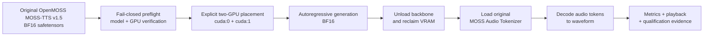

# MOSS-TTS v1.5 on Kaggle T4x2 GPU

<p align="center">
  <a href="https://github.com/dangkhoa2016/MOSS-TTS-v1.5-On-Kaggle-T4x2-GPU/actions/workflows/repository-audit.yml"></a>
  <a href="LICENSE"></a>
  <a href="THIRD_PARTY_LICENSES/OPENMOSS-APACHE-2.0"></a>
  
  
  
  
  
  
  
</p>

> 🌐 Language / Ngôn ngữ: **English** | [Tiếng Việt](README.vi.md)

**Run the original 8.49B `OpenMOSS-Team/MOSS-TTS-v1.5` BF16 checkpoint on two independent 16 GB NVIDIA Tesla T4 GPUs — without GGUF conversion, quantization, model-weight rewriting, or architecture changes.**

MOSS-TTS v1.5 is large enough that its BF16 weights alone occupy roughly **15.8 GiB**. A naïve single-T4 deployment is therefore impractical, while Kaggle T4 x2 does **not** provide one pooled 32 GB GPU. This project solves that constraint through explicit two-GPU module placement, numerically stable BF16 execution, a staged backbone-to-codec lifecycle, and fail-closed runtime verification.

The result is a reproducible Kaggle production path for the original upstream checkpoint, backed by bilingual documentation, measured runtime evidence, seven reviewer-facing qualification cases, and explicit human listening review.

This is an **independent engineering qualification project**, not an official OpenMOSS release.

## Why this project exists

The goal is deliberately narrow: make the **original upstream model** practical on commodity Kaggle T4 x2 hardware without changing what the model is.

The deployment must satisfy all of these constraints at once:

- preserve the original BF16 safetensors checkpoint;
- use two independent Tesla T4 16 GB GPUs rather than pretending they form one 32 GB device;
- avoid GGUF, Q4/Q8, INT4/INT8, AWQ, GPTQ, or any other release quantization path;
- avoid rewriting model weights or replacing the checkpoint with a smaller derivative;
- keep the upstream model architecture unchanged;
- keep the large autoregressive backbone and the audio tokenizer from competing for VRAM at the same time;
- prove the runtime contract with machine-readable verification rather than relying only on prose claims.

This repository is therefore about **runtime and deployment engineering around the original checkpoint**.

## What this repository provides

| Capability | What is included |
|---|---|
| Original-model deployment | BF16 safetensors execution for `OpenMOSS-Team/MOSS-TTS-v1.5` |
| Two-GPU runtime | explicit module placement across two independent Tesla T4 16 GB GPUs |
| Memory lifecycle | backbone generation followed by unload, then MOSS Audio Tokenizer decode |
| Runtime verification | GPU topology, model identity, BF16 dtype, safetensors completeness, module coverage, no unexpected quantization/patching |
| Kaggle workflow | canonical production notebook with immutable release-source pinning |
| Qualification | Vietnamese, English, bidirectional code-switching, and IPA control cases |
| Measurements | generation/decode RTF, synthesis time, audio duration, and peak allocated VRAM |
| Evidence | retained executed notebook, manifest, checkpoint SHA-256 authority, and human-listening records |
| Documentation | bilingual architecture, reproducibility, benchmark, troubleshooting, history, and evidence guides |

## Architecture



The design separates **model placement** from **codec residency**. During text/audio-token generation the autoregressive backbone spans both GPUs. After generation, the backbone is released before the original MOSS Audio Tokenizer is loaded for waveform decoding.

Qualified placement:

| Component | Device |
|---|---|
| token embeddings | `cuda:0` |
| rotary embedding | `cuda:0` |
| decoder layers 0–13 | `cuda:0` |
| decoder layers 14–35 | `cuda:1` |
| final norm | `cuda:0` |
| external audio embeddings | `cuda:0` |
| LM/audio output heads | `cuda:0` |
| precision | BF16 |

Accelerate hooks participate in runtime placement, but this is **not tensor parallelism** and **not pooled VRAM**.

## Quick start on Kaggle

Canonical notebook:

[`notebooks/kaggle-production-demo.ipynb`](notebooks/kaggle-production-demo.ipynb)

1. Import the canonical notebook into Kaggle.
2. Select **Accelerator → GPU T4 x2**.
3. Attach Kaggle Model `dangkhoa2016/openmoss-team-moss-tts-v1-5`.
4. Keep **Internet = ON** for source checkout and dependency bootstrap.
5. Leave `MOSS_TTS_SOURCE_REF` unset for the normal released workflow; the notebook defaults to immutable tag **`v1.0.0`**.
6. Use **Restart Session → Run All**.
7. Verify the machine-readable PASS markers.
8. Listen to the generated outputs before treating the run as reviewer-facing evidence.

An exact 40-character commit SHA can be supplied through `MOSS_TTS_SOURCE_REF` for an immutable audit override. Mutable refs such as `main` are rejected as runtime authority.

The notebook bootstraps `requirements/kaggle.txt`, resolves the immutable source, validates the T4 x2 topology, verifies model identity/BF16 safetensors, performs staged generation and decode, records timing/RTF and peak VRAM, exposes inline playback, and derives a machine-readable qualification summary.

## Engineering design

### BF16 instead of FP16

FP16 was investigated and rejected for the qualified path. Development diagnostics observed **activation overflow and non-finite logits around decoder layer 6/7**. The project therefore retains BF16 because it matches the checkpoint-declared dtype, remained finite on the qualified runtime, and preserves the original floating-point weights.

BF16 here is **not quantization**.

### Explicit placement instead of implicit balancing

The runtime uses a documented device map rather than relying on an opaque automatic split. Loaded modules are checked against the safetensors weight map so placement becomes part of the verified execution contract.

This matters because two T4 devices are separate memory domains. The deployment is designed around that reality instead of presenting T4 x2 as a unified 32 GB accelerator.

### Staged backbone-to-codec lifecycle

The autoregressive backbone and codec are not kept resident simultaneously without need. The qualified lifecycle is:

1. load the MOSS-TTS backbone across both GPUs;
2. generate audio tokens;
3. release the large backbone;
4. reclaim GPU memory;
5. load the original MOSS Audio Tokenizer;
6. decode tokens into waveform audio.

This is the key memory-management strategy that lets the original model and original tokenizer share constrained hardware at different stages.

### Fail-closed verification

The runtime validates:

- exactly two Tesla T4 devices;
- upstream model identity, architecture, and model type;
- declared `bfloat16` precision;
- safetensors shard completeness;
- floating tensor dtype from safetensors headers;
- loaded-module coverage against the weight map;
- absence of GGUF;
- absence of unexpected quantization;
- absence of model-weight patching;
- absence of architecture replacement.

Core run markers:

```text
GPU_T4X2=PASS
MODEL_IDENTITY_AND_SAFETENSORS=PASS
MOSS_TTS_GENERATION=PASS
KAGGLE_PRODUCTION_DEMO=PASS
```

## Qualified results

The retained qualification run covers seven reviewer-facing cases:

| Case | Coverage | Audio duration |
|---|---|---:|
| `vi_narrative` | Vietnamese narrative | 10.80 s |
| `vi_longform` | longer Vietnamese speech | 14.96 s |
| `en_narrative` | English narrative | 12.32 s |
| `en_technical` | English technical speech | 13.36 s |
| `mix_vi_en` | Vietnamese → English code-switching | 17.92 s |
| `mix_en_vi` | English → Vietnamese code-switching | 11.92 s |
| `ipa` | native IPA pronunciation control | 5.36 s |

All seven outputs completed the BF16 inference and waveform-decoding path and were explicitly reviewed by listening:

```text
HUMAN_LISTENING_REVIEW=PASS
```

Measured candidate-run results:

| Metric | Result |
|---|---:|
| Synthesized audio | **86.64 s** |
| Four-stage synthesis time | **~449.02 s** |
| Average generation RTF | **~1.410** |
| Generation RTF range | **~1.243–1.776** |
| Average decode RTF | **~0.801** |
| Peak allocated VRAM — GPU0 | **~8.014 GiB** |
| Peak allocated VRAM — GPU1 | **~7.966 GiB** |

These measurements describe the qualified Kaggle T4 x2 run and are **not universal performance guarantees**.

Detailed pronunciation observations, including the comparison between grapheme/casing strategies and upstream-supported IPA control, are documented separately in [docs/pronunciation-control.md](docs/pronunciation-control.md).

## Verification and reproducibility

The repository separates **execution evidence** from **release authority** so provenance remains traceable.

The retained executed candidate notebook was produced from source revision:

```text
f43518ea4b866b42a75c7b600ab146d1b9005bd8
```

That SHA identifies the exact repository state that produced the retained notebook outputs. The raw executed notebook is preserved byte-for-byte; it is not rewritten retroactively after human review.

The released production workflow uses immutable tag `v1.0.0` as its default source authority.

Checkpoint integrity is anchored by the confirmed SHA-256 inventory in `references/checkpoint-sha256.json`. Full checkpoint re-hashing can be enabled explicitly with `VERIFY_CHECKPOINT_SHA256` when an independent byte-level verification is required; the default production path uses the previously qualified digest authority to avoid re-reading roughly 15.8 GiB on every run.

For the full evidence model, checksums, methodology, and provenance rules, see:

- [Reproducibility guide](docs/reproducibility.md)
- [Evidence index](docs/evidence-index.md)
- [Benchmark methodology](docs/benchmark-methodology.md)
- [Qualification matrix](docs/qualification-matrix.md)

## Scope and non-goals

This project does **not** claim or use:

- a pooled/unified 32 GB GPU;
- tensor parallelism;
- GGUF;
- Q4/Q8 or other release quantization;
- rewritten model weights;
- a modified upstream architecture;
- a substituted smaller checkpoint;
- hidden post-processing presented as model output;
- universal benchmark performance from one Kaggle environment.

The repository demonstrates a verified deployment path for the **original BF16 MOSS-TTS v1.5 checkpoint** on the specific Kaggle T4 x2 target.

## Documentation

| Topic | English | Tiếng Việt |
|---|---|---|
| Documentation index | [docs/README.md](docs/README.md) | [docs/README.vi.md](docs/README.vi.md) |
| Engineering overview | [docs/engineering-overview.md](docs/engineering-overview.md) | [docs/engineering-overview.vi.md](docs/engineering-overview.vi.md) |
| Architecture | [docs/architecture.md](docs/architecture.md) | [docs/architecture.vi.md](docs/architecture.vi.md) |
| Reproducibility | [docs/reproducibility.md](docs/reproducibility.md) | [docs/reproducibility.vi.md](docs/reproducibility.vi.md) |
| Benchmark methodology | [docs/benchmark-methodology.md](docs/benchmark-methodology.md) | [docs/benchmark-methodology.vi.md](docs/benchmark-methodology.vi.md) |
| Qualification matrix | [docs/qualification-matrix.md](docs/qualification-matrix.md) | [docs/qualification-matrix.vi.md](docs/qualification-matrix.vi.md) |
| Pronunciation control | [docs/pronunciation-control.md](docs/pronunciation-control.md) | [docs/pronunciation-control.vi.md](docs/pronunciation-control.vi.md) |
| Evidence index | [docs/evidence-index.md](docs/evidence-index.md) | [docs/evidence-index.vi.md](docs/evidence-index.vi.md) |
| Development history | [docs/development-history.md](docs/development-history.md) | [docs/development-history.vi.md](docs/development-history.vi.md) |
| Troubleshooting | [docs/troubleshooting.md](docs/troubleshooting.md) | [docs/troubleshooting.vi.md](docs/troubleshooting.vi.md) |

## Repository layout

```text
moss_t4x2/                 runtime, preflight, placement and verification logic
scripts/                   inventory, generation, qualification and benchmark entry points
notebooks/                 canonical Kaggle production notebook and usage guidance
docs/                      architecture, engineering, benchmark and reproducibility docs
evidence/                  evidence metadata and human-listening records
references/                upstream identity and checkpoint digest authority
requirements/              Kaggle dependency baseline
tests/                     repository and runtime contract tests
```

Model weights are intentionally **not** stored in this Git repository.

## Release

`v1.0.0` is the first public release of this independent deployment project. It packages the qualified source authority, bilingual documentation, repository audit, retained execution evidence, checkpoint verification records, and human-listening acceptance artifacts.

For release-specific details, use [RELEASE_NOTES_v1.0.0.md](RELEASE_NOTES_v1.0.0.md) and the [GitHub v1.0.0 release](https://github.com/dangkhoa2016/MOSS-TTS-v1.5-On-Kaggle-T4x2-GPU/releases/tag/v1.0.0).

## Licensing and attribution

Repository-authored code and documentation are MIT licensed by **Đăng Khoa <i.am@dangkhoa.dev>**.

Upstream OpenMOSS source, model weights, tokenizers, and codecs retain their upstream terms. See:

- [LICENSE-NOTES.md](LICENSE-NOTES.md)
- [NOTICE.txt](NOTICE.txt)
- [`THIRD_PARTY_LICENSES/`](THIRD_PARTY_LICENSES/)

---

**Model:** `OpenMOSS-Team/MOSS-TTS-v1.5`
**Target:** Kaggle Tesla T4 x2
**Precision:** original BF16
**Quantization:** None
**GGUF:** No
**Model-weight modification:** No
**Architecture modification:** No
