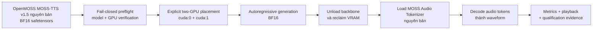

# MOSS-TTS v1.5 trên Kaggle T4x2 GPU

<p align="center">
  <a href="https://github.com/dangkhoa2016/MOSS-TTS-v1.5-On-Kaggle-T4x2-GPU/actions/workflows/repository-audit.yml"></a>
  <a href="LICENSE"></a>
  <a href="THIRD_PARTY_LICENSES/OPENMOSS-APACHE-2.0"></a>
  
  
  
  
  
  
  
</p>

> 🌐 Language / Ngôn ngữ: [English](README.md) | **Tiếng Việt**

**Chạy checkpoint BF16 nguyên bản 8.49B `OpenMOSS-Team/MOSS-TTS-v1.5` trên hai GPU NVIDIA Tesla T4 16 GB độc lập — không chuyển GGUF, không quantization, không rewrite model weight và không sửa kiến trúc.**

MOSS-TTS v1.5 đủ lớn để riêng phần BF16 weight đã chiếm khoảng **15.8 GiB**. Vì vậy load trực tiếp trên một T4 là không thực tế, trong khi Kaggle T4 x2 cũng **không** tạo thành một GPU 32 GB VRAM gộp chung. Dự án giải quyết ràng buộc đó bằng explicit two-GPU module placement, BF16 execution ổn định, staged lifecycle từ backbone sang codec và fail-closed runtime verification.

Kết quả là một production path có thể tái lập trên Kaggle cho checkpoint upstream nguyên bản, đi kèm tài liệu song ngữ, runtime evidence đo được, bảy qualification case dành cho reviewer và explicit human listening review.

Đây là **dự án engineering qualification độc lập**, không phải release chính thức của OpenMOSS.

## Vì sao dự án này tồn tại

Mục tiêu được giới hạn rất rõ: làm cho **model upstream nguyên bản** có thể chạy thực tế trên Kaggle T4 x2 mà không thay đổi bản chất của model.

Deployment phải đồng thời đáp ứng các ràng buộc sau:

- giữ checkpoint BF16 safetensors nguyên bản;
- sử dụng hai Tesla T4 16 GB độc lập thay vì giả định chúng hợp thành một thiết bị 32 GB;
- không dùng GGUF, Q4/Q8, INT4/INT8, AWQ, GPTQ hoặc release quantization path khác;
- không rewrite model weight và không thay checkpoint bằng một derivative nhỏ hơn;
- giữ nguyên upstream model architecture;
- tránh để autoregressive backbone lớn và audio tokenizer cùng tranh VRAM khi không cần thiết;
- chứng minh runtime contract bằng machine-readable verification thay vì chỉ bằng mô tả prose.

Vì vậy repository này tập trung vào **runtime và deployment engineering xung quanh checkpoint nguyên bản**.

## Repository này cung cấp gì

| Khả năng | Nội dung |
|---|---|
| Original-model deployment | BF16 safetensors execution cho `OpenMOSS-Team/MOSS-TTS-v1.5` |
| Two-GPU runtime | explicit module placement trên hai Tesla T4 16 GB độc lập |
| Memory lifecycle | backbone generation → unload → MOSS Audio Tokenizer decode |
| Runtime verification | GPU topology, model identity, BF16 dtype, safetensors completeness, module coverage, không quantization/patching ngoài dự kiến |
| Kaggle workflow | canonical production notebook với immutable release-source pinning |
| Qualification | tiếng Việt, tiếng Anh, code-switch hai chiều và IPA control |
| Measurements | generation/decode RTF, synthesis time, audio duration và peak allocated VRAM |
| Evidence | retained executed notebook, manifest, checkpoint SHA-256 authority và human-listening records |
| Documentation | tài liệu song ngữ về architecture, reproducibility, benchmark, troubleshooting, history và evidence |

## Kiến trúc



Thiết kế tách rõ **model placement** khỏi **codec residency**. Trong giai đoạn tạo text/audio token, autoregressive backbone trải trên cả hai GPU. Sau generation, backbone được giải phóng trước khi MOSS Audio Tokenizer nguyên bản được load để decode waveform.

Qualified placement:

| Thành phần | Thiết bị |
|---|---|
| token embeddings | `cuda:0` |
| rotary embedding | `cuda:0` |
| decoder layers 0–13 | `cuda:0` |
| decoder layers 14–35 | `cuda:1` |
| final norm | `cuda:0` |
| external audio embeddings | `cuda:0` |
| LM/audio output heads | `cuda:0` |
| precision | BF16 |

Accelerate hooks tham gia runtime placement, nhưng đây **không phải tensor parallelism** và **không phải pooled VRAM**.

## Chạy nhanh trên Kaggle

Canonical notebook:

[`notebooks/kaggle-production-demo.ipynb`](notebooks/kaggle-production-demo.ipynb)

1. Import canonical notebook vào Kaggle.
2. Chọn **Accelerator → GPU T4 x2**.
3. Attach Kaggle Model `dangkhoa2016/openmoss-team-moss-tts-v1-5`.
4. Bật **Internet = ON** để source checkout và dependency bootstrap.
5. Với released workflow thông thường, để `MOSS_TTS_SOURCE_REF` unset; notebook mặc định dùng immutable tag **`v1.0.0`**.
6. Chọn **Restart Session → Run All**.
7. Kiểm tra các machine-readable PASS marker.
8. Nghe lại generated outputs trước khi coi run là reviewer-facing evidence.

Có thể truyền commit SHA chính xác 40 ký tự qua `MOSS_TTS_SOURCE_REF` khi cần immutable audit override. Mutable refs như `main` bị từ chối làm runtime authority.

Notebook bootstrap `requirements/kaggle.txt`, resolve immutable source, validate T4 x2 topology, verify model identity/BF16 safetensors, chạy staged generation và decode, ghi timing/RTF cùng peak VRAM, hỗ trợ inline playback và tạo machine-readable qualification summary.

## Thiết kế engineering

### BF16 thay vì FP16

FP16 đã được điều tra và bị loại khỏi qualified path. Diagnostics trong quá trình phát triển quan sát thấy **activation overflow và non-finite logits quanh decoder layer 6/7**. Vì vậy dự án giữ BF16 do nó khớp checkpoint-declared dtype, giữ execution finite trên qualified runtime và bảo toàn floating-point weights nguyên bản.

BF16 ở đây **không phải quantization**.

### Explicit placement thay vì implicit balancing

Runtime sử dụng một device map được tài liệu hóa rõ ràng thay vì dựa vào opaque automatic split. Loaded modules được đối chiếu với safetensors weight map để placement trở thành một phần của verified execution contract.

Điều này quan trọng vì hai T4 là hai memory domain riêng biệt. Deployment được thiết kế theo thực tế đó thay vì trình bày T4 x2 như một accelerator 32 GB hợp nhất.

### Staged backbone-to-codec lifecycle

Autoregressive backbone và codec không bị giữ resident đồng thời khi không cần. Qualified lifecycle là:

1. load MOSS-TTS backbone trên cả hai GPU;
2. generate audio tokens;
3. release backbone lớn;
4. reclaim GPU memory;
5. load MOSS Audio Tokenizer nguyên bản;
6. decode token thành waveform audio.

Đây là memory-management strategy cốt lõi giúp model nguyên bản và tokenizer nguyên bản chia sẻ phần cứng hạn chế ở các giai đoạn khác nhau.

### Fail-closed verification

Runtime kiểm tra:

- đúng hai Tesla T4;
- upstream model identity, architecture và model type;
- precision khai báo `bfloat16`;
- safetensors shard completeness;
- floating tensor dtype từ safetensors header;
- loaded-module coverage so với weight map;
- không có GGUF;
- không có unexpected quantization;
- không có model-weight patching;
- không có architecture replacement.

Core run markers:

```text
GPU_T4X2=PASS
MODEL_IDENTITY_AND_SAFETENSORS=PASS
MOSS_TTS_GENERATION=PASS
KAGGLE_PRODUCTION_DEMO=PASS
```

## Kết quả đã qualification

Retained qualification run bao gồm bảy case dành cho reviewer:

| Case | Phạm vi | Thời lượng audio |
|---|---|---:|
| `vi_narrative` | Vietnamese narrative | 10.80 s |
| `vi_longform` | Vietnamese dài hơn | 14.96 s |
| `en_narrative` | English narrative | 12.32 s |
| `en_technical` | English technical speech | 13.36 s |
| `mix_vi_en` | code-switch Việt → Anh | 17.92 s |
| `mix_en_vi` | code-switch Anh → Việt | 11.92 s |
| `ipa` | native IPA pronunciation control | 5.36 s |

Cả bảy output đều hoàn thành BF16 inference + waveform-decoding path và đã được nghe kiểm tra trực tiếp:

```text
HUMAN_LISTENING_REVIEW=PASS
```

Measured candidate-run results:

| Metric | Kết quả |
|---|---:|
| Synthesized audio | **86.64 s** |
| Four-stage synthesis time | **~449.02 s** |
| Generation RTF trung bình | **~1.410** |
| Khoảng generation RTF | **~1.243–1.776** |
| Decode RTF trung bình | **~0.801** |
| Peak allocated VRAM — GPU0 | **~8.014 GiB** |
| Peak allocated VRAM — GPU1 | **~7.966 GiB** |

Các số liệu này mô tả qualified Kaggle T4 x2 run và **không phải universal performance guarantees**.

Các quan sát chi tiết về pronunciation, bao gồm so sánh grapheme/casing với upstream-supported IPA control, được đưa sang [docs/pronunciation-control.vi.md](docs/pronunciation-control.vi.md).

## Verification và khả năng tái lập

Repository tách **execution evidence** khỏi **release authority** để provenance luôn traceable.

Retained executed candidate notebook được tạo từ source revision:

```text
f43518ea4b866b42a75c7b600ab146d1b9005bd8
```

SHA này xác định chính xác repository state đã tạo ra retained notebook outputs. Raw executed notebook được giữ nguyên byte-for-byte và không bị rewrite hồi tố sau human review.

Released production workflow mặc định sử dụng immutable tag `v1.0.0` làm source authority.

Tính toàn vẹn của checkpoint được đối chiếu với bộ SHA-256 đã xác nhận trong `references/checkpoint-sha256.json`. Khi cần kiểm chứng độc lập ở mức byte, có thể bật `VERIFY_CHECKPOINT_SHA256` để hash lại toàn bộ checkpoint; production path mặc định dùng digest authority đã qualification để tránh đọc lại khoảng 15.8 GiB ở mỗi run.

Xem đầy đủ evidence model, checksum, methodology và provenance rules tại:

- [Hướng dẫn tái lập](docs/reproducibility.vi.md)
- [Chỉ mục evidence](docs/evidence-index.vi.md)
- [Phương pháp benchmark](docs/benchmark-methodology.vi.md)
- [Ma trận qualification](docs/qualification-matrix.vi.md)

## Phạm vi và những gì dự án không tuyên bố

Dự án **không** tuyên bố hoặc sử dụng:

- một GPU 32 GB VRAM pooled/unified;
- tensor parallelism;
- GGUF;
- Q4/Q8 hoặc release quantization khác;
- model weight đã rewrite;
- upstream architecture đã sửa;
- checkpoint nhỏ hơn được thay thế;
- hidden post-processing được trình bày như model output;
- universal benchmark performance từ một Kaggle environment duy nhất.

Repository chứng minh một verified deployment path cho **checkpoint BF16 MOSS-TTS v1.5 nguyên bản** trên target Kaggle T4 x2 cụ thể.

## Tài liệu

| Chủ đề | English | Tiếng Việt |
|---|---|---|
| Documentation index | [docs/README.md](docs/README.md) | [docs/README.vi.md](docs/README.vi.md) |
| Engineering overview | [docs/engineering-overview.md](docs/engineering-overview.md) | [docs/engineering-overview.vi.md](docs/engineering-overview.vi.md) |
| Architecture | [docs/architecture.md](docs/architecture.md) | [docs/architecture.vi.md](docs/architecture.vi.md) |
| Reproducibility | [docs/reproducibility.md](docs/reproducibility.md) | [docs/reproducibility.vi.md](docs/reproducibility.vi.md) |
| Benchmark methodology | [docs/benchmark-methodology.md](docs/benchmark-methodology.md) | [docs/benchmark-methodology.vi.md](docs/benchmark-methodology.vi.md) |
| Qualification matrix | [docs/qualification-matrix.md](docs/qualification-matrix.md) | [docs/qualification-matrix.vi.md](docs/qualification-matrix.vi.md) |
| Pronunciation control | [docs/pronunciation-control.md](docs/pronunciation-control.md) | [docs/pronunciation-control.vi.md](docs/pronunciation-control.vi.md) |
| Evidence index | [docs/evidence-index.md](docs/evidence-index.md) | [docs/evidence-index.vi.md](docs/evidence-index.vi.md) |
| Development history | [docs/development-history.md](docs/development-history.md) | [docs/development-history.vi.md](docs/development-history.vi.md) |
| Troubleshooting | [docs/troubleshooting.md](docs/troubleshooting.md) | [docs/troubleshooting.vi.md](docs/troubleshooting.vi.md) |

## Cấu trúc repository

```text
moss_t4x2/                 runtime, preflight, placement và verification logic
scripts/                   inventory, generation, qualification và benchmark entry points
notebooks/                 canonical Kaggle production notebook và usage guidance
docs/                      architecture, engineering, benchmark và reproducibility docs
evidence/                  evidence metadata và human-listening records
references/                upstream identity và checkpoint digest authority
requirements/              Kaggle dependency baseline
tests/                     repository và runtime contract tests
```

Model weights chủ động **không** được lưu trong Git repository này.

## Release

`v1.0.0` là public release đầu tiên của independent deployment project này. Release đóng gói qualified source authority, tài liệu song ngữ, repository audit, retained execution evidence, checkpoint verification records và human-listening acceptance artifacts.

Để xem thông tin dành riêng cho release, dùng [RELEASE_NOTES_v1.0.0.vi.md](RELEASE_NOTES_v1.0.0.vi.md) và [GitHub release v1.0.0](https://github.com/dangkhoa2016/MOSS-TTS-v1.5-On-Kaggle-T4x2-GPU/releases/tag/v1.0.0).

## Giấy phép và attribution

Code và documentation do repository này viết dùng MIT License của **Đăng Khoa <i.am@dangkhoa.dev>**.

OpenMOSS source, model weights, tokenizer và codec upstream giữ nguyên điều khoản upstream. Xem:

- [LICENSE-NOTES.vi.md](LICENSE-NOTES.vi.md)
- [NOTICE.txt](NOTICE.txt)
- [`THIRD_PARTY_LICENSES/`](THIRD_PARTY_LICENSES/)

---

**Model:** `OpenMOSS-Team/MOSS-TTS-v1.5`
**Target:** Kaggle Tesla T4 x2
**Precision:** original BF16
**Quantization:** None
**GGUF:** No
**Model-weight modification:** No
**Architecture modification:** No
